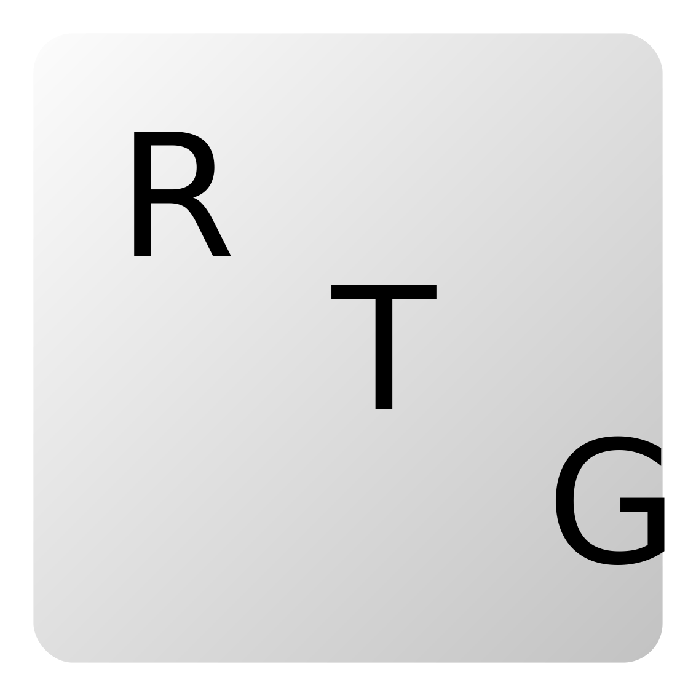

<!-- Project Header -->

 
  

  <h1 class="projectName">Random Text Generator for Outlook</h1>

  

    
    
    
    
  

  
  

    A browser extension that temporarily replaces private email content in Outlook with random text for development purposes.
  

  
   

## 👋 About
A browser extension that temporarily replaces private email content in Outlook with random text for development purposes. This is used by the [Dark Mode for Outlook] extension to generate screenshots that can be uploaded to extension stores.

## 📦 Installation
Download the repository, run `npm install` to install dependencies, and build the project with `npm start`. Make sure you have npm and Node.js v10.0.0 or greater installed ([how?](https://docs.npmjs.com/downloading-and-installing-node-js-and-npm)). If you have any issues running the build script, you can perform all the steps in that script manually.

Next, the build directory or zip file can be loaded into your browser of choice: [Chrome](https://developer.chrome.com/extensions/getstarted#manifest) / [Firefox](https://extensionworkshop.com/documentation/develop/temporary-installation-in-firefox/) / [Edge](https://docs.microsoft.com/en-us/microsoft-edge/extensions-chromium/getting-started/part1-simple-extension#run-your-extension-locally-in-your-browser-while-developing-it-side-loading) / [Opera](https://dev.opera.com/extensions/testing/)

## 🕹️ Usage
Install the extension and click the browser action button while on one of the following domains to run the replacement script:
- http(s)://outlook.live.com/
- http(s)://outlook.office.com/
- http(s)://outlook.office365.com/
- http(s)://support.office.live.com/

Senders' names are replaced with random American names and attachments are hidden completely. Subjects, messages, and folders are replaced with random Lorem Ipsum text. See [Dark Mode for Outlook] for example screenshots.

## 🤝 Contributing
Since this project is small, we use a MAJOR.MINOR versioning system where the major version is bumped on breaking changes and the minor version is bumped on all other features and bug fixes.

## 🧾 License
This project is licensed under the [MIT License](LICENSE). This project includes various resources which carry their own copyright notices and license terms. See [LICENSE-THIRD-PARTY.md](LICENSE-THIRD-PARTY.md) for more details.

Outlook is a trademark of Microsoft and this project is not affiliated with or endorsed by Microsoft in any way.

## 🖇️ Related
- **[Dark Mode for Outlook]**: A browser extension/add-on that applies a better dark theme to Microsoft Outlook and removes ads. Available for Chrome, Firefox, Edge, and Opera, with partial support for Firefox mobile!

## 💕 Funding
Find this project useful? [Sponsoring me](https://johng.io/funding) will help me cover costs and **_commit_** more time to open-source.

If you can't donate but still want to contribute, don't worry. There are many other ways to help out, like:

- 📢 reporting (submitting feature requests & bug reports)
- 👨‍💻 coding (implementing features & fixing bugs)
- 📝 writing (documenting & translating)
- 💬 spreading the word
- ⭐ starring the project

I appreciate the support!

[Dark Mode for Outlook]: https://github.com/jerboa88/dark-mode-for-outlook
